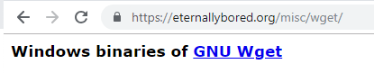
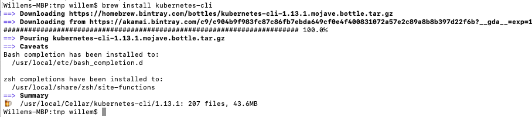
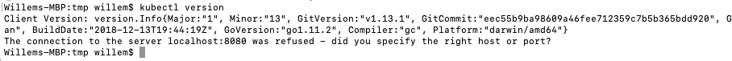

.. _prereqs:

-------------
Needed stuff
-------------

.. _enable_karbon:

Enable Karbon in PRISM Central
++++++++++++++++++++++++++++++

Before we can use Karbon, we need to enable it in PRISM Central. Follow these steps to enable Karbon.

#. Login to your PRISM Central instance.
#. Click on the three dash in the top left corner.

	.. image:: images/1.png 

#. Goto **Services** -> **Karbon**. 

	.. image:: images/2.png

	If you click on the Star Icon, it will be on top of the list.

	.. image:: images/3.png

#. In the screen that now appears there will be a button called **Enable Karbon**

	.. image:: images/4.png

#. Click this button. Karbon will now be activated/deployed.

	.. image:: images/5.png

#. After a few mnutes (depending on the resources your cluster has) Karbon will be activated. Click on the **here** link to open the Karbon UI.

	.. image:: images/6.png

#. Your Karbon instance is ready for use.

.. _uploadimages:

Upload images
+++++++++++++

Karbon needs to have images it can use. To make is easy for all users Nutanix has already prebuild two images based on **Ubuntu 16.0.4. LTS** and **CentOS 7.4**. Only these images are supported for now. If you or the customer wants to use other distributions of Linux, for now the anwser is sorry we can't do that right now.

To upload images proceed with the normal process that you would do for other images.

#. Open the **Image Configuration** wizard.
#. Click on **Upload file**.

	.. image:: images/7.png

#. In the **Image Source** screen provide the following parameters:
	
	#. **URL:** http://download.nutanix.com/karbon/0.8/acs-ubuntu1604.qcow2
	#. **Image Name:** acs-ubuntu (This most be staring with **acs-** or Karbon will **NOT** recognize the image!!)
	#. **Image Type:** Disk
	#. **Image Description:** can be left blank

	.. image:: images/8.png

#. Click the **Save** button and wait for the process to finish
#. Repeat the former step, but change the following parameters:

	#. **URL:** http://download.nutanix.com/karbon/0.8/acs-centos7.qcow2
	#. **Image Name:** acs-centos (This most be staring with **acs-** or Karbon will **NOT** recognize the image!!)
	#. **Image Type:** Disk
	#. **Image Description:** can be left blank

	.. image:: images/9.png

#. Click the **Save** button and wait for the process to finish

|

Your Karbon environment is ready to start using the images.

:ref:`sources`

.. _installwget:

Install wget
++++++++++++

During the deployment of the application the ``wget`` command is used to pull the configuration files for kubernetes. To get the YAML files from the commandline we need to have wget as an application available. This part show where to download, if needed, this simple tool.

Windows
=======

For Windows you can download the wget as a standalone application from http://eternallybored.org/misc/wget. Save the file to a known location. During the modules we kept it in the Downloads folder of the current logged in user.

Mac OS
======

For Mac OS we could use the ``curl`` command. That means that you can use the build in tools without making any changes to your system. curl shows the information and not by default saves it to a file. A way to make this happen is to add the ``-o`` parameter the the command. As an example:

``wget https://kubernetes.io/examples/application/wordpress/mysql-deployment.yaml`` would translate into ``curl https://kubernetes.io/examples/application/wordpress/mysql-deployment.yaml -o mysql-deployment.yaml``

If you want to use ``wget`` and not translating into the ``curl`` command, you have to install wget. The installation process is a bit different then on the Windows environment. To get the wget command follow the next steps:

.. note:: In the below steps we are going to install ``wget`` using the Homebrew method. There are other methods, use google to search for other means.

|

.. note:: To have the Homebrew installed you need **Xcode** first! Install Xcode from your App Store! Then follow the below steps. **Not sooner**.

|

#. Open a Terminal session on your Mac
#. Install Homebrew on your Mac using :

	``/usr/bin/ruby -e "$(curl -fsSL https://raw.githubusercontent.com/Homebrew/install/master/install)"``. Provide your password if asked for.

	.. image:: images/13.png

#. Install the ``wget`` using Homebrew by typing ``brew install wget``

	.. image:: images/15.png

#. Check that ``wget`` has been installed by just typing wget. It should provide some error messages
	
	.. image:: images/16.png

Now you can use the ``wget`` command so you can follow the modules to the letter....

:ref:`sources`

Linux
=====

wget is build into the Operationg System. Nothing needs to be done to use ``wget``.

.. _install_kubectl:

Install kubectl
+++++++++++++++

The ``kubectl`` command will be used to connect to the created kubernetes cluster so we can manipulate it. By default ``kubectl`` is not installed on the machines. To get it installed and available use on of the installation "guides" for your Operating System.

Windows
=======

For Windows we can simply download the ``.exe`` file from the internet.

As we have the ``wget`` command to our disposal, we are ging to use that command to "download" the ``kubectl.exe`` file that will be used in the modules.

#. Open a commandline on your machine.
#. cd to the Downloads directory on your machine using ``cd Downloads``.
#. Type ``wget http://storage.googleapis.com/kubernetes-release/release/v0.16.1/bin/windows/amd64/kubectl.exe``. This will download and save the file into the Downloads directory where we are in.

	.. image:: images/17.png

#. Run in the commandline ``kubectl`` this should show some error messages

	.. image:: images/18.png

The ``kubectl`` command can now be used as long as you are in the Downloads directory. This is what we will be doing during the workshop.

:ref:`sources`

Linux
=====

There are different methods to install kubectl per distribution.

For Ubuntu:
-----------

#. Open a console and run the following command ``sudo snap install kubectl --classic`` this will install the kubectl package using the snap packagemanager

	.. image:: images/19.png

#. Run ``kubectl version`` to see if kubectl has been installed. This should show messages

	.. image:: images/20.png

The ``kubectl`` command is ready to be used.

|

For CentOS
----------

#. Open a console/terminal.
#. Run the following command

	.. code-block:: bash
		:name: inline-code

		cat <<EOF > /etc/yum.repos.d/kubernetes.repo
		[kubernetes]
		name=Kubernetes
		baseurl=https://packages.cloud.google.com/yum/repos/kubernetes-el7-x86_64
		enabled=1
		gpgcheck=1
		repo_gpgcheck=1
		gpgkey=https://packages.cloud.google.com/yum/doc/yum-key.gpg https://packages.cloud.google.com/yum/doc/rpm-package-key.gpg
		EOF
		yum install -y kubectl

	.. image:: images/21.png

#. Run the ``kubectl version`` command to see that it has been installed

	.. image:: images/23.png

Your machine is ready to run the ``kubectl`` command.

|

Mac OS
======

As we already have the Homebrew installed, we can just use the command ``brew install kubernetes-cli`` to install kubectl.

Run ``kubectl`` to see it has been installed.

Your machine is ready to use the ``kubectl`` command.

:ref:`sources`

_________

.. _sources:

**Sources:** 
++++++++++++

- https://portal.nutanix.com/#/page/docs/details?targetId=Karbon-v08:Karbon-v08 - Karbon user guide for the URLs of the two images used.
- https://brew.sh - For installing Homebrew on Mac OS.
- https://www.mkyong.com/mac/wget-on-mac-os-x/ - For installing wget on Mac OS.
- https://github.com/kubernetes/kubernetes/issues/41463 - For installing kubectl on Windows. First look at ``https://storage.googleapis.com/kubernetes-release/release/stable.txt`` to get the latest version of the kubectl.exe file. Then create the URL ``http://storage.googleapis.com/kubernetes-release/release/v0.16.1/bin/windows/amd64/kubectl.exe`` where **v0.16.1** in the URL needs to edited to the latest release version.
- https://kubernetes.io/docs/tasks/tools/install-kubectl/ - For installing on Linux distributions.