.. Adding labels to the beginning of your lab is helpful for linking to the lab from other pages
.. _create_wp:

---------------------
Create an Application
---------------------

Overview
++++++++

In this module you are going to create an application on the Kubernetes Cluster you've created earlier. The application we are going to deploy is Wordpress using MySQL as the database layer.

.. note:: **Make sure you have the pre-requirements installed and ready for running!** If you are not sure please follow :ref:`prereqs` to make sure you have the required applications available.

The following will be done in this module:

#. Download a so called ``kubeconfig`` file.
#. Setup the commandline
#. Use kubectl command
	
	- Cluster and client version
	- Cluster info
	- Which pods are running
	- Install wordpress

#. Create the Wordpress application
#. Open the Wordpress application

.. note:: All the screenshots have been created using a Windows machine. This due to the fact that most of the tools that are used for this module are not easy to be installed/used. Also the directory in which is being run from commands is the Downloads directory of the logged in user.

Download the kubeconfig
+++++++++++++++++++++++

To get access to the kubernetes cluster, we need to make use of a kubeconfig file. This is a generic way of referring to configuration files. It does not mean that there is a file named kubeconfig.

The kubeconfig file can be downloaded from the cluster. In the list of the runnin clusters, select the wordpress cluster by selecting the checkbox. As soon as that has happened the button **Download kubeconfig** will become active.

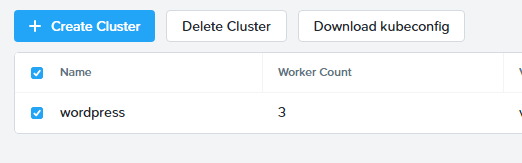

|

Save the file to your location of choice. In our example, we leave the fill in the **Downloads** directory of the user. If using Chrome, it will show a warning that the file might harm your machine. Just click on the **Keep** button to save the file.

|

|

Setup the commandline
+++++++++++++++++++++

Open a commandline as the administrator by clicking on the Windos icon, bottom left corner and start typing **cmd**. This will end up in showing the command line. Then right click and select **Run as Administrator**. 

The ``kubectl`` command needs to use the kubeconfig file to make the connection to the kubernetes cluster. To make this work, in the command line type the following command:
``set KUBECONFIG=<NAME OF THE KUBECONFIG FILE>``. After that check that the KUBECONFIG variable has been defined with the right data by typing ``echo %KUBECONFIG%``.This should reply with the kubeconfig file you have downloaded earlier. Below screenhost is showing an example.

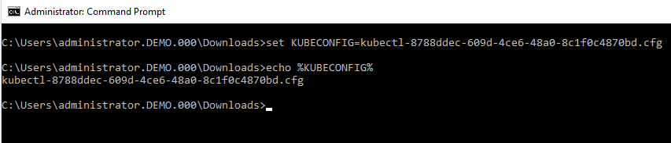

|

Use kubectl command
+++++++++++++++++++

Now that you have defined the kubeconfig file, you should be able to connect to the kubernetes cluster. 

Cluster and client version
##########################

Type ``kubectl version`` to see the version of the kubernetes client and server.

.. image:: images/5.png

|

Cluster info
============

To see the information of the kubernetes cluster, type ``kubectl cluster-info``. This will provide inforamtion where the **Kubernetes master** is running and the **KubeDNS URL**.

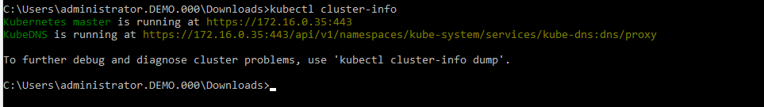

|

Cluster nodes
=============

To see which master and worker nodes are in the kubernetes cluster, type ``kubectl get nodes``.

.. image:: images/7.png

|

Running pods
============

If you are interested in all the pods that are running after the installation of the kubernetes cluster use ``kubectl get pods --all-namespaces``.

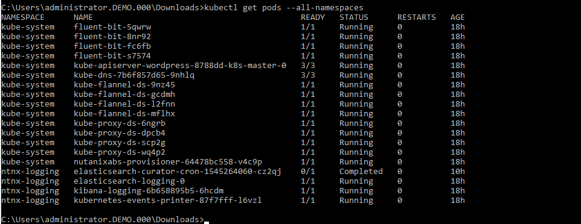

|

Install wordpress
=================

Now that you have seen the high level information of the kubernetes cluster it is time to create our Wordpress application.

Create a directory in the location you are in via the commandline named **wordpress** using ``mkdir wordpress`` and move into that directory via ``cd wordpress``. 

|

.. note:: Kubernetes needs yaml files to create applications and their dependencies. You are going to download two yaml files and store them in the just created **wordpress** directory. Look at https://www.mirantis.com/blog/introduction-to-yaml-creating-a-kubernetes-deployment/ or at https://kubernetes.io/docs/concepts/workloads/controllers/deployment/ to get more information on yaml and kubernetes. ** MAKE SURE YOU ARE IN THE WORDPRESS DIRECTORY BEFORE PROCEEDING!!!**

|

In the commandline type ``wget https://kubernetes.io/examples/application/wordpress/mysql-deployment.yaml`` to download the needed yaml file for wordpress mysql deployment.

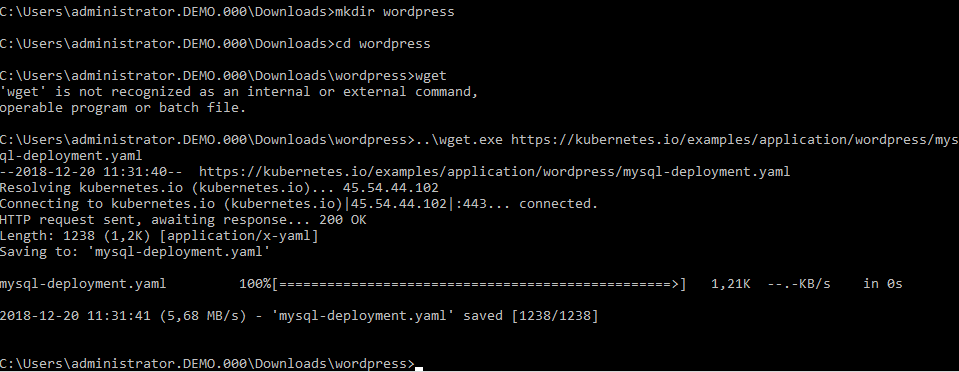

|

Type ``wget https://kubernetes.io/examples/application/wordpress/wordpress-deployment.yaml`` to download the needed yaml file for wordpress deployment.

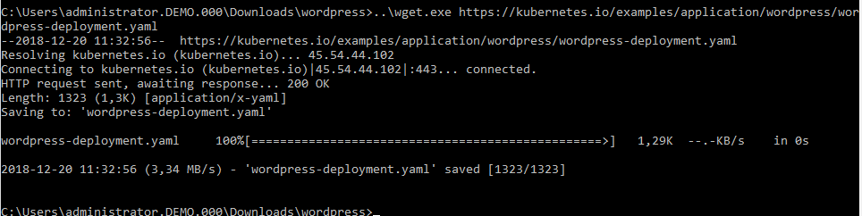

|

Now open the wordpress-deployment.yaml file with your preferred text editor. 

.. note:: For Windows, please use WordPad. Notepad has the whole yaml file on one line and makes it hard the read/change the file. 

Change the line that shows: ``type: LoadBalancer`` under ``spec:`` and change ``LoadBalancer`` into ``NodePort``. Reason for this change is that Karbon does not (yet) support LoadBalanced.

.. image:: images/12.png

|

**Change back** to the directory where you have saved the ``kubectl.exe`` file. Then run the following command to create the mysql password:

``kubectl create secret generic mysql-pass --from-literal=password=KARBON`` this should return ``secret/mysql=pass created``.

.. image:: images/13.png

|

To check that the password has been created use the command ``kubectl get secrets``. This should show mysql-pass under NAME.

.. image:: images/14.png

|

Creating the MySQL database is done by using the command ``kubectl create -f wordpress\mysql-deployment.yaml``.

.. image:: images/15.png

|

This will also create persistent storage.

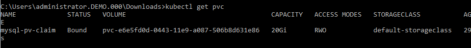

|

This storage will also show up in the Karbon UI under wordpress -> Volume.

.. image:: images/17.png 

|

Now running ``kubectl get pods`` will show the wordpress-mysql pod running.

.. image:: images/18.png

|

To create the wordpress application, type ``kubectl create -f wordpress\wordpress-deployment.yaml``.

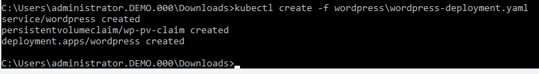

|

This will also create persistent storage and a pod.
|

Our wordpress with mysql application is now running. Now we need to make a connection to the wordpress UI to configure the application. To get the IP address where the UI is running, we need to see what the worker nodes are on which the applciation is running.

In the command line type ``kubectl get nodes``. This will show a list of a Master and three worker nodes. 

.. image:: images/23.png

|

To get the IP address of one of the workers, type ``kubetcl describe node <NAME OF ONE OF THE WORKER NODES>``

.. image:: images/24.png

|

Search in the information that is provided, a line that starts with **Address:** and note the **InternalIP**.

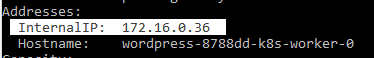

|

As the application is running on an internal network inside the kubernetes cluster, we also need to have the service port on which the wordpress application is running. Use ``kubectl get services wordpress`` to see which port number must be used to connect to the wordpress application.

.. image:: images/26.png

|

Putting the IP address and the service port together we can open the wordpress UI. in our example \http://172.16.0.36:32387.

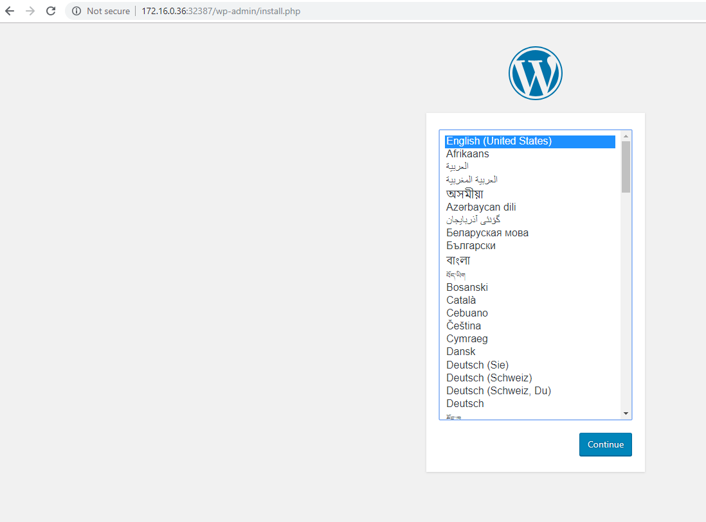

|

In the initial configuration page, provide the parameters that are asked for. At the end of the settings, click the **Log in** button and login to the Wordpress UI.

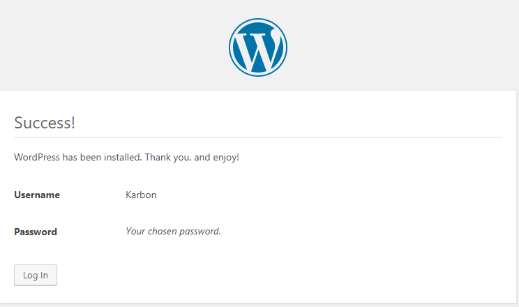

|

Your Wordpress applicaition with MySQL as the database is running and ready....

|

|

.. note:: **This concludes the end of this part of the module. You now have a running a Wordpress application within your Kubernetes Cluster.**

______________________________

Takeaways
+++++++++

- Here is where we summarize any key takeaways from the module
- Such as how a Nutanix feature used in the lab delivers value
- Or highlighting a differentiator
