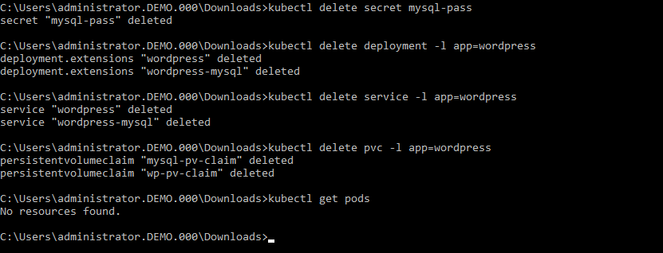

.. Adding labels to the beginning of your lab is helpful for linking to the lab from other pages
.. _delete_wp:

----------------------------------------
Delete the created environment
----------------------------------------

Overview
++++++++

Once every while you may need to delete the applicaiton that has been created. This module of the workshop shows how you can delete a created application and Kubernetes cluster.

.. note::

  The following actions **can not** be undone!!! If running this in a production environment be very carefull..

Deleting the application
++++++++++++++++++++++++

Open een commandline so we can run the ``kubectl`` command to delete the created password, application, service and the persistent storage that have been created earlier.

Run the following commands from the commandline 

.. code-block:: bash
  :name: Delete_app

  kubectl delete mysql-pass

  kubectl delete deployment -p app=wordpress

  kubectl delete service -l app=wordpress

  kubectl delete pvc -l app=wordpress

Then check to see if the pods are deleted by running the command ``kubectl get pods``. There should be no resources shown.

Below screenshots shows all the commands and their return information from the kubernetes cluster

In the Karbon UI, under the properties of the Wordpress cluster -> Volume, there should only be one **Claim name** called ``elasticsearch-xxx``. The earlier created claims should be gone. The below screenshot is an example.

.. figure:: images/2.png

Deleting the Wordpress Cluster
++++++++++++++++++++++++++++++

Deleting the cluster is almost as easy as deleting a Virtual Machine.

In the Karbon UI, select in the list of clusters the wordpress cluster. Click on the **Delete Cluster** button.

.. figure:: images/3.png 

Accept the Warning message that pops up by clicking **Delete**.

.. figure:: images/4.png 

.. note:: **This concludes the Delete module of the Karbon workshop**

___________

Takeaways
+++++++++

- Here is where we summarize any key takeaways from the module
- Such as how a Nutanix feature used in the lab delivers value
- Or highlighting a differentiator
