.. _karbon_create_cluster:

-------------------------------------
Karbon: Creating a Kubernetes Cluster
-------------------------------------

Overview
++++++++

Before we can deploy an application using kubernetes we need to create a Kubernetes cluster.

The cluster that we are going to create consists out of the following VMs:

- 1 Master node (VM)
- 3 Worker node (VMs)
- 3 etcd nodes (VMs)

.. note::

  For more information on the terms master, worker and etcd, please look at https://kubernetes.io/docs/concepts/.

Create a Karbon Kubernetes Cluster
++++++++++++++++++++++++++++++++++

In this exercise you will create a production ready Kubernetes cluster with Nutanix Karbon.

Navigate to **Prism Central > Select the Three Dashes > Karbon** and ensure you see a ‘Karbon is successfully enabled’ notification.

Click the link to open the Karbon Console.

.. image:: images/karbon_create_cluster_0.png

Next click **+ Create Cluster**.

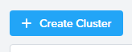

Fill in the following:

**Name and Environment**

- **Name** - wordpress-*initialsLowerCase*
- **Cluster** - Leave Default selected
- **Kubernetes Version** - 1.10.3
- **Host OS Image** - centos

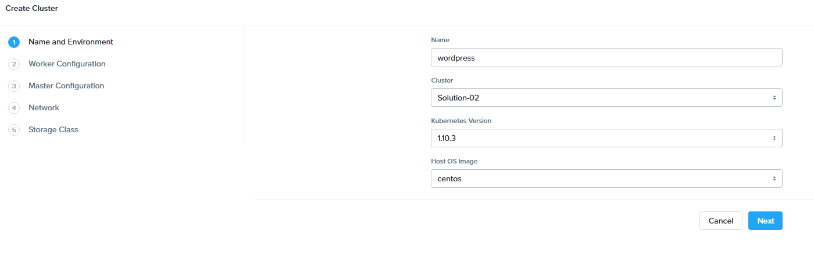

Click **Next**

**Worker Configuration**

.. note::

  This defines the number of worker nodes that will run the Kubernetes pods.

Leave all defaults

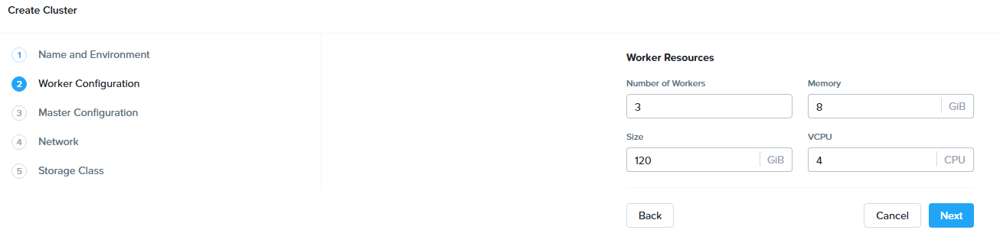

Click **Next**.

**Master Configuration**

.. note::

  This defines the number of master nodes that controls the Kubernetes cluster, and the number of etcd VMs, which manages the cluster state.

Leave all defaults.

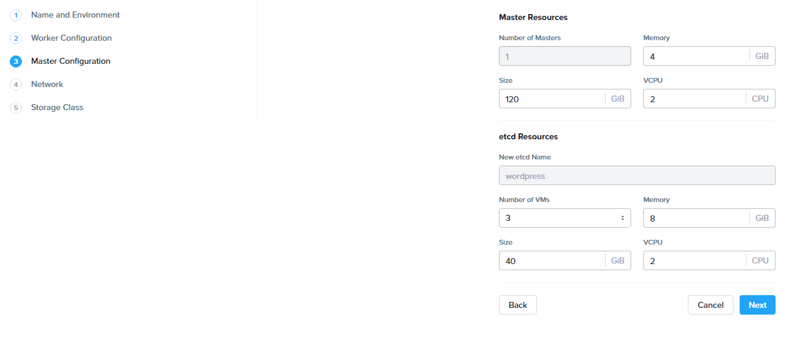

click **Next**.

**Network**

.. note::

  We use flannel as the network provider. More information on Flannel can be found here: https://github.com/coreos/flannel#flannel

- **Network Provider** - Flannel
- **VM Network** - Primary
- **Service CIDR** - Leave the default of 172.19.0.0/16
- **Pod CIDR** - Leave the default of 172.20.0.0/16

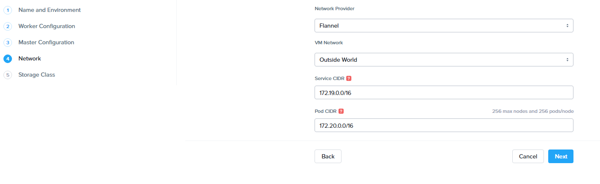

Click **Next**

**Storage Class**

- **Storage Class Name** - default-storageclass-*initialsLowerCase*
- **Prism Element Cluster** - Leave default selected
- **Cluster Username** - admin
- **Cluster Password** - *HPOC Password*
- **Storage Container Name** - default-container-XXXXXXX
- **File System** - ext4

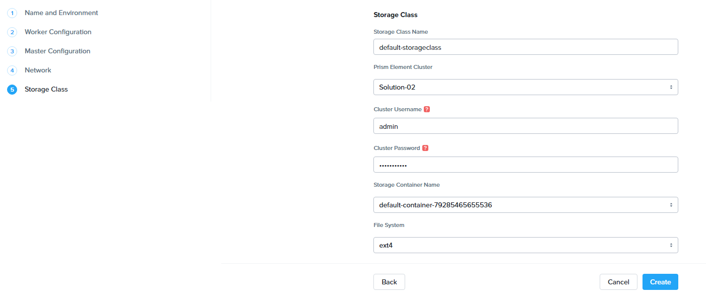

Click **Create**

.. note::

  **Wait until the cluster has been created before proceeding**

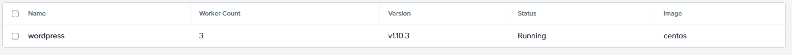

During the creation of the Kubernetes cluster there will have been created:

- VMs

.. image:: images/karbon_create_cluster_10.png

- Persistent Storage as VolumeGroup

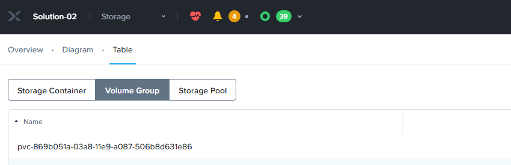

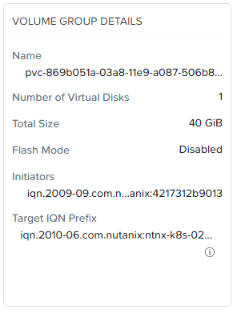

Cluster properties
++++++++++++++++++

In the Karbon UI, click on your cluster "wordpress-*initialsLowerCase*"

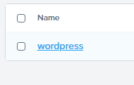

This will take you to the Summary page for your cluster.

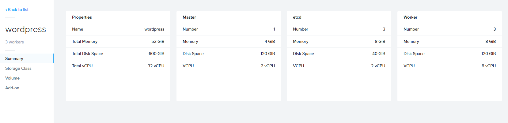

You can also click into the following to see specific information:

- Storage Classes

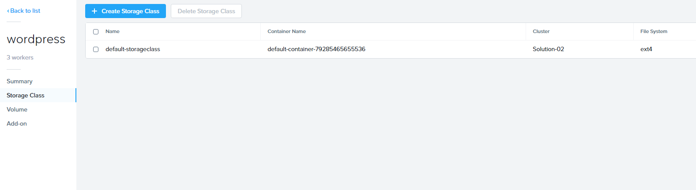

- Volume's

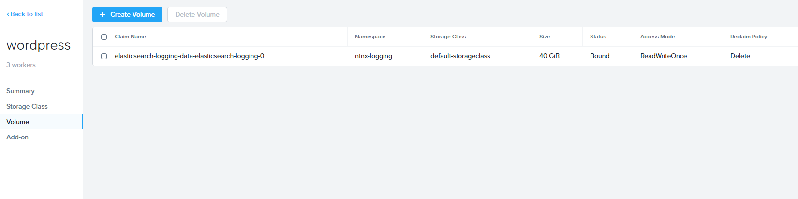

- Add-on's

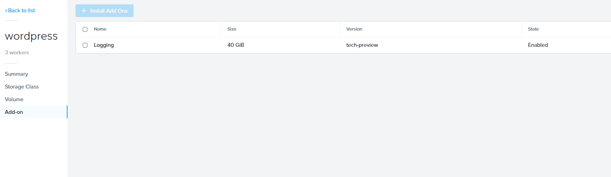

You now have a running Kubernetes Cluster called "wordpress-*initialsLowerCase*".

Takeaways
+++++++++

- Nutanix Karbon makes it very easy to create and manage kubernetes clusters
