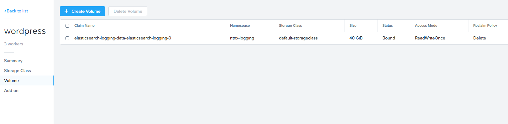
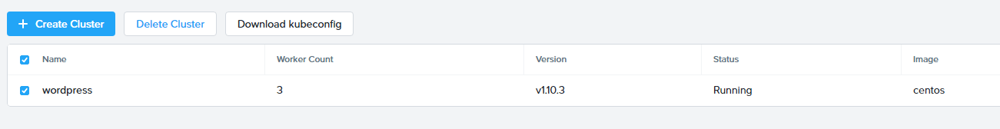
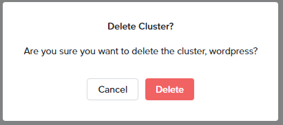

.. _karbon_delete_application:

-----------------------------
Karbon: Delete an Application
-----------------------------

Overview
++++++++

Once every while you may need to delete the application that has been created.

In this lab we show how you can delete a created application and Kubernetes cluster.

.. note::

  The following actions **can not** be undone!!! If running this in a production environment be very careful.

Deleting an application
+++++++++++++++++++++++

From the command line we will run the **kubectl** command to delete the created password, application, service and the persistent storage that we created earlier.

Run the following commands from the command line:

.. code-block:: bash
  :name: Delete_app

  kubectl delete mysql-pass

  kubectl delete deployment -p app=wordpress

  kubectl delete service -l app=wordpress

  kubectl delete pvc -l app=wordpress

You can check to see if the pods are deleted by running the following command:

.. code-block:: bash

  kubectl get pods

There should be no resources shown.

.. figure:: images/karbon_delete_application_1.png

In the Karbon UI, under the properties of the **wordpress-*initialsLowerCase* -> Volume**, there should only be one **Claim name** called **elasticsearch-xxx**.

The earlier created claims should be gone.

Deleting the Wordpress Cluster
++++++++++++++++++++++++++++++

Deleting the cluster is almost as easy as deleting a Virtual Machine.

In the Karbon UI, select your "wordpress-*initialsLowerCase*" cluster.

Click on the **Delete Cluster** button.

Accept the Warning message that pops up by clicking **Delete**.

You have now deleted your Karbon Kubernetes cluster.

Takeaways
+++++++++
