.. _karbon_deploy_application:

-----------------------------
Karbon: Deploy an Application
-----------------------------

Overview
++++++++

In this module you are going to deploy the Wordpress on the Kubernetes Cluster you've created earlier (using MySQL as the database layer).

.. note::

	**Make sure you have the pre-requirements installed and ready for running!**
	If you are not sure please follow :ref:`install_wget` and :ref:`install_kubectl` to make sure you have the required applications available.

In this lab we will download the kubeconfig, interact with our cluster from the command line with kubectl, and deploy the Wordpress application.

.. note::

	All the screenshots have been created using a Windows machine. This due to the fact that most of the tools that are used for this module are not easy to be installed/used. Also the directory in which is being run from commands is the Downloads directory of the logged in user.

Set up Kubeconfig
+++++++++++++++++

In this task you will download your Karbon Kubernetes cluster’s kubeconfig file and apply that file to **kubectl** to enable you to control your Kubernetes cluster.

Navigate back to the Karbon UI.  If your session has timed out, log back in with your Prism Central credentials.

Select the cluster that you deployed, and click **Download kubeconfig**.

.. image:: images/karbon_deploy_application_1.png

Configure kubeconfig Using Mac
..............................

From Terminal, run the following commands to setup your **kubeconfig**:

.. code-block:: bash

  cd ~
  mkdir .kube
  cd .kube
  mv ~/Downloads/kubectl* config
  kubectl get nodes

Verify that the output of the last command shows 1 master node, and 3 worker nodes.

Configure kubeconfig Using Windows
..................................

From PowerShell, run the following commands to setup your **kubeconfig**:

.. code-block:: bash

  cd ~
  mkdir .kube
  cd .kube
  mv ~\Downloads\kubectl* config
  kubectl get nodes

Verify that the output of the last command shows 1 master node, and 3 worker nodes.

Use kubectl command
+++++++++++++++++++

Now that you have defined the kubeconfig file, you should be able to connect to the kubernetes cluster.

Cluster and client version
..........................

To see the version of the kubernetes client and server run:

.. code-block:: bash

	kubectl version

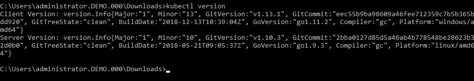

Cluster info
............

To see the information of the kubernetes cluster run:.

.. code-block:: bash

	kubectl cluster-info

This will provide information on where the **Kubernetes Master** is running and the **KubeDNS URL**.

.. image:: images/karbon_deploy_application_6.png

Cluster nodes
.............

To see which master and worker nodes are in the kubernetes cluster run:

.. code-block:: bash

	kubectl get nodes

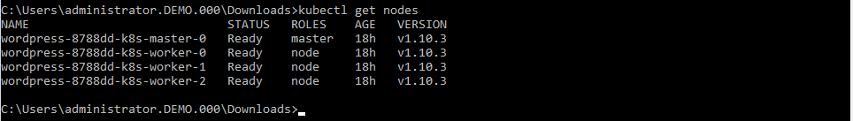

Running pods
............

If you are interested in all the pods that are running after the installation of the kubernetes cluster run:

.. code-block:: bash

	kubectl get pods --all-namespaces

.. image:: images/karbon_deploy_application_8.png

Deploy Wordpress
++++++++++++++++

Now that you have seen the high level information of the kubernetes cluster it is time to deploy our Wordpress application.

Create a directory in the location you are in via the command line named **wordpress**, and change into that directory.

.. code-block:: bash

	mkdir wordpress

	cd wordpress

.. note::

	Kubernetes needs yaml files to create applications and their dependencies.
	You are going to download two yaml files and store them in the just created **wordpress** directory.
	Look at https://www.mirantis.com/blog/introduction-to-yaml-creating-a-kubernetes-deployment/ or at https://kubernetes.io/docs/concepts/workloads/controllers/deployment/ to get more information on yaml and kubernetes.

	** MAKE SURE YOU ARE IN THE WORDPRESS DIRECTORY BEFORE PROCEEDING!!!**

To download the needed yaml file for wordpress mysql deployment run the following command:

.. code-block:: bash

	wget https://kubernetes.io/examples/application/wordpress/mysql-deployment.yaml

.. image:: images/karbon_deploy_application_9.png

To download the needed yaml file for wordpress deployment run the following command:

.. code-block:: bash

	wget https://kubernetes.io/examples/application/wordpress/wordpress-deployment.yaml

.. image:: images/karbon_deploy_application_10.png

Now open the wordpress-deployment.yaml file with your preferred text editor.

.. note::

  Use **WordPad** on Windows for opening and editing **YAML** files.

  On Mac use **TextEdit** for opening and editing **YAML** files.

Change the line that shows: **type: LoadBalancer** under **spec:** and change ``LoadBalancer`` into ``NodePort``.

.. note::

	Reason for this change is that Karbon does not (yet) support LoadBalanced.

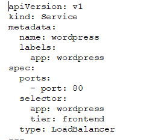

**Change back** to the **kube** directory, and then run the following command to create the mysql password:

.. code-block:: bash

	kubectl create secret generic mysql-pass --from-literal=password=Nutanix/4u!

This should return:

.. code-block:: bash

	secret/mysql=pass created

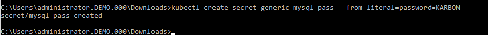

To check that the password has been created, run the following command:

.. code-block:: bash

	kubectl get secrets

This should show mysql-pass under NAME.

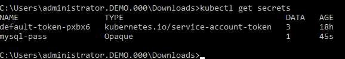

Creating the MySQL database is done by running the following command:

.. code-block:: bash

	kubectl create -f wordpress\mysql-deployment.yaml

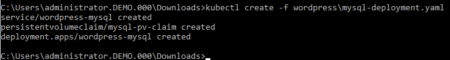

This will also create persistent storage.

.. image:: images/karbon_deploy_application_16.png

This storage will also show up in the Karbon UI under **wordpress -> Volume**.

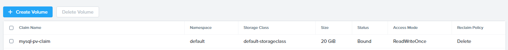

You can now run the following command:

.. code-block:: bash

	kubectl get pods

It will show the wordpress-mysql pod running.

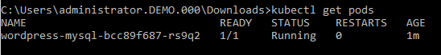

To create the wordpress application, run the following command:

.. code-block:: bash

	kubectl create -f wordpress\wordpress-deployment.yaml

.. image:: images/karbon_deploy_application_19.png

This will also create persistent storage and a pod.

You can now run the following command:

.. code-block:: bash

	kubectl get pods

It will show both pods running.

Accessing Wordpress
+++++++++++++++++++

Our Wordpress with mysql application is now running.

Now we need to make a connection to the Wordpress UI to configure the application.

To get the IP address where the UI is running, we need to see what the worker nodes are on which the application is running.

Lets show a list of a Master and worker nodes, run the following command:

.. code-block:: bash

	kubectl get nodes

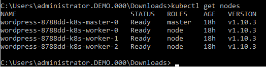

To get the IP address of one of the workers, run the following command:

.. code-block:: bash

	kubectl describe nodes | Select-String -Pattern "InternalIP"

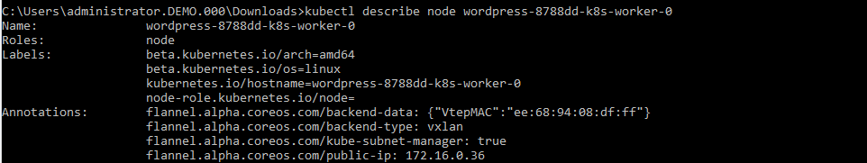

Search in the information that is provided, a line that starts with **Address:** and note the **InternalIP**.

.. image:: images/karbon_deploy_application_25.png

As the application is running on an internal network inside the kubernetes cluster, we also need to have the service port on which the wordpress application is running.

To see which port number is used to for the Wordpress application, run the following command:

.. code-block:: bash

	kubectl get services wordpress

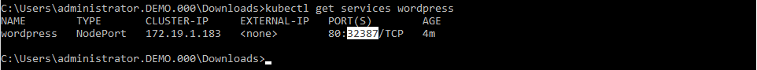

Putting the IP address and the service port together we can open the Wordpress UI. In our example 172.16.0.36:32387.

In a new Browser tab, go to \http://172.16.0.36:32387

.. image:: images/karbon_deploy_application_27.png

In the initial configuration page, provide the parameters that are asked for.

At the end of the settings, click the **Log in** button and login to the Wordpress UI.

.. image:: images/karbon_deploy_application_29.png

Your Wordpress application with MySQL as the database is running and ready....

Takeaways
+++++++++
