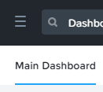
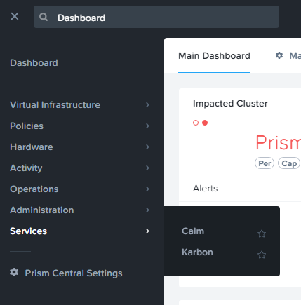
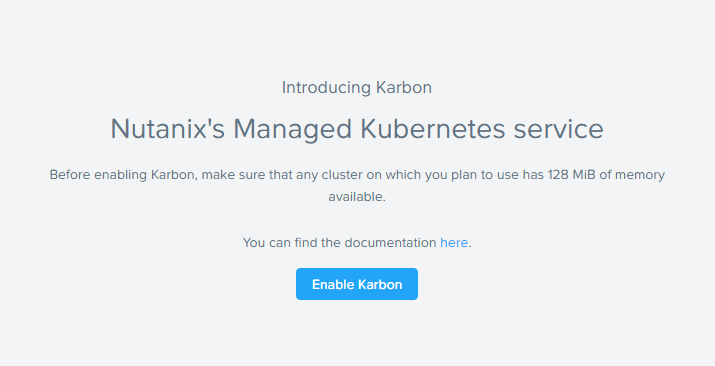
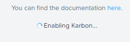
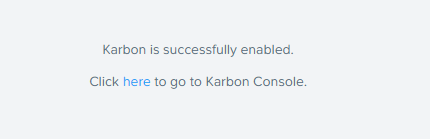
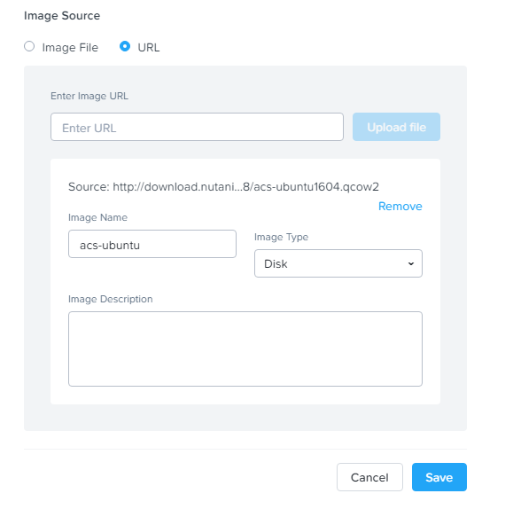
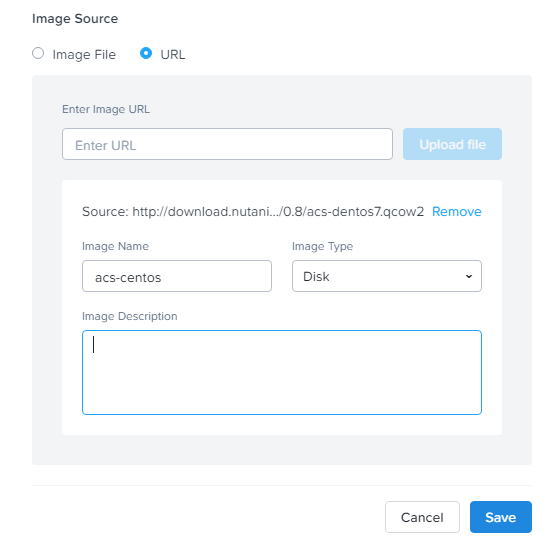

.. _karbon_enable_and_images:

--------------------------------
Karbon: Enable and Upload Images
--------------------------------

Overview
++++++++

.. note::

  Estimated time to complete: **15 MINUTES**

In this exercise you will enable Nutanix Karbon and upload the Karbon OS images to your Nutanix cluster.

Enable Karbon in Prism Central
++++++++++++++++++++++++++++++

Before we can use Karbon, we need to enable it in Prism Central following these steps:

Open \https://*<Prism-Central-IP>*:9440/ in a browser and log in.

Click on the three dash in the top left corner.

Go to **Services** > **Karbon**.

If you click on the Star Icon, it will be on top of the list.

.. image:: images/karbon_enable_and_images_3.png

Click the **Enable Karbon** button.

 Karbon will now be activated/deployed.

After a few minutes (depending on the resources your cluster has) Karbon will be activated.

Click on the **here** link to open the Karbon UI.

Your Karbon instance is ready for use.

Upload images
+++++++++++++

Karbon needs to have images it can use.

Nutanix has prebuilt two images based on **Ubuntu 16.0.4. LTS** and **CentOS 7.4**.

Only these images are supported for now.

.. note::

  If you or the customer wants to use other distributions of Linux, for now the answer is "sorry we can't do that right now".

Upload Ubuntu Image
...................

To upload images proceed with the normal process that you would do for other images.

Open the **Image Configuration** wizard.

Click on **Upload file**.

In the **Image Source** screen provide the following parameters:

- **URL:** -  http://download.nutanix.com/karbon/0.8/acs-ubuntu1604.qcow2
- **Image Name:** - acs-ubuntu (This most be staring with **acs-** or Karbon will **NOT** recognize the image!!)
- **Image Type:** - Disk
- **Image Description:** - can be left blank

Click the **Save**

Upload CentOS Image
...................

To upload images proceed with the normal process that you would do for other images.

Open the **Image Configuration** wizard.

Click on **Upload file**.

In the **Image Source** screen provide the following parameters:

- **URL:** - http://download.nutanix.com/karbon/0.8/acs-centos7.qcow2
- **Image Name:** - acs-centos (This most be staring with **acs-** or Karbon will **NOT** recognize the image!!)
- **Image Type:** - Disk
- **Image Description:** - can be left blank

Click the **Save**

Your Karbon environment is ready to start using the images.
